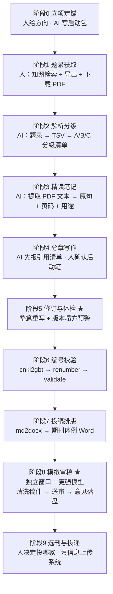

<div align="center">

# 📚 ScholarRelay文献接力

**崭新的法学论文写作工作流**

学校webVPN 里的文献 AI 拿不到——那一棒交给人，其余全程由 AI 接力

[](LICENSE)
[](https://www.python.org/)
[](references/)
[](scripts/)
[]()

[核心问题](#问题一机构订阅文献库拿不到全文本项目存在的根本原因) • [十阶段流程](#十阶段流程) • [能力映射](#这套工作流对应的法学专业能力) • [快速开始](#快速开始) • [演示输出](examples/演示输出.md)

> 📌 **第一次来？** 先看 [**问题一：AI搞不定学校的webvpn?**](#问题一机构订阅文献库拿不到全文本项目存在的根本原因)
> （这是本项目存在的理由），再看 [`examples/演示输出.md`](examples/演示输出.md)（无需安装，直接看结果）。
>****本人系某985院校法学专业的本科学生，已经通过自己的努力公开发表三篇法学学术论文，虽然我的水平不高，但自认为我与AI AGENT交互合作的方法具有一定可借鉴性。本文档旨在帮助法学专业的大学生通过更简单的人机协作完成论文写作，甚至公开发表，加油法学生，去发表自己的第一篇论文吧！！****
> 我在文档当中炼化了自己的人机协作作品，吸纳了一些既有的方法。本文档也是由AI协助制作，如有不当，敬请指教


</div>

---
## 09.21怎么安装和使用（人话版）

鉴于法学uu对github和agent可能使用比较少，特出此节。
安装方法1：复制本页面链接到任意agent客户端（例如workbuddy、trae）,在对话框输入“为我安装这个skill”命令其安装

安装方法2：在项目主页面点击大大的绿色按钮“CODE”，在展开栏目点击“download zip”，将下载下来的zip文件发送给任意agent客户端（例如workbuddy、trae）,在对话框输入“为我安装这个skill”命令其安装

如果你完全没在电脑上用过VScode、Python，或者任意AIagent客户端，那么，请你在安装完毕后，在同一对话框命令AI“安装该skill运行必备的其他配件和环境”

如何投入使用：在agent客户端对话界面点击“技能”或者“skill”按钮，在展开栏中选择“scholarrelay”,即可基于本项目发出命令。

如有新的问题可以联络我的小红书私讯。如果你成功使用起来了，记得在项目页面给我star⭐

## 三十秒看懂

法学论文栽跟头，很少栽在"想得不深"，多半栽在**低级但致命**的地方。这些错误人眼会漏，脚本一秒查出：

| 常见错误 | 本项目的检测 |
|---|---|
| 参考文献里同一篇文献重复占两个编号 | ✅ 内容去重，自动合并 |
| 增删文献后正文编号整体错位 | ✅ 按首次出现顺序重排 |
| 期刊文献缺起止页码 | ✅ 从知网题录自动补全，**不可能编造** |
| 摘要里出现"本文"（法学核心期刊严禁） | ✅ 摘要专项扫描，直接标严重 |
| "学界普遍认为"却不给具体文献 | ✅ 模糊归因检测 |
| 把"江西九江"写成"江苏九江" | ✅ 投稿检查清单逐项核对 |
| 越改越啰嗦、最后崩掉 | ✅ 版本字数曲线 + 结构塌方预警 |
| 每篇文献 PDF 都要重新想办法提取文本 | ✅ 一条命令批量转（PyMuPDF，比 pypdf 快约 12 倍），自动识别扫描件 |
| AI 稿满篇半角直引号 `"` | ✅ 实测 AI 稿 634 处直引号、定稿 0 处——一键转全角弯引号，左右自动配对 |
| AI 用 `1 / 1.1` 编号，中文期刊要 `一、/（一）` | ✅ 标题编号体系检测 + 规则文档 |

**[→ 看真实运行结果（`examples/演示输出.md`）](examples/演示输出.md)**　无需安装，直接看输出。

---

## 这套工作流对应的法学专业能力

> 本项目不是"用 AI 写论文"的提示词合集。它的主体是**把法学研究规范落成可执行检查**。
> 下面这张表说明了它覆盖哪些法学专业能力，以及每个能力落在哪个文件里。

| 法学专业能力 | 在项目中的体现 | 对应文件 |
|---|---|---|
| **法学文献检索与筛选** | 题录结构化解析（RefWorks / EndNote 双格式）、A/B/C 三档分级标准、来源类别筛选（CSSCI／北大核心） | `02` `03` `parse_cnki.py` |
| **学术规范与引注** | GB/T 7714 顺序编码制 + 《法学引注手册》两套体例、期刊起止页码强制补全、DOI 清理、编号一一对应校验 | `06` `cnki2gbt.py` `validate.py` `renumber.py` |
| **法学期刊投稿素养** | 摘要 200—300 字／单段／**禁"本文"**、关键词禁用自创概念、期刊四梯队匹配、审稿人视角与常见负面意见 | `10` `12` |
| **法学论证严谨性** | 四类硬伤专查：事实性错误、口径混淆（地方/国家数据、不同时点）、数值嫁接、结论先于证据 | `05` `08` |
| **证据意识与学术诚信** | 不编造文献／法条／案例／数据；五级来源标注（原文核实／摘要参考／二手引用／媒体转引／待核实）；发现引了未读原著**直接删引用** | `05` `11` |
| **法律文本核验** | 法条条号随修订而变（如《反不正当竞争法》虚假宣传条款由第 8 条变为第 9 条）；案例的编号／当事人／裁判要点三者一致 | `05` `verify`（`13` 配套技能） |
| **研究方法广度** | 实战覆盖：劳动法与社会保障法、竞争法、电影产业法、法思想史（文本考据） | `09` 实战对照 |
| **学术写作与文字把控** | 去 AI 腔四层清单、修订纪律（反补丁迭代）、车轱辘话与超长句机械检测、**中文标点与标题编号规范（一、/（一）/1.）** | `09` `11` `15` `redundancy.py` `aitrace.py` `normalize_cn.py` |

---

## 它解决什么真实问题

### 问题一：机构订阅文献库拿不到全文（**本项目存在的根本原因**）

知网这类文献库对**个人账号没有下载额度**。能下载靠的是**机构订阅**，
而机构订阅的校验是三层叠加的：

| 层 | 校验什么 | 为什么自动化很难 |
|---|---|---|
| **① IP 授权** | 请求是否来自机构出口 IP | 必须先连入学校 **webvpn**，让知网看到机构 IP |
| **② 登录态** | 是否有有效会话 | 会话绑真实浏览器 cookie，常带设备指纹 |
| **③ 下载额度** | 当日还能下几篇 | 超限即拒，且无法预测何时触发 |

**任何一层不过，拿到的只是摘要页，不是全文。这是一个访问授权问题，不是"写个爬虫"能解决的。**

已有的"自动查文献"类技能通常要求使用者先自己配好浏览器自动化
（常驻进程、CDP 端口、登录态保持、验证码人工介入、风控拦截后重试）——
**对非专业使用者，这一步的门槛高于写论文本身。** 结果就是：工具装上了，全文下不下来。

**本项目的解法：人将refworks格式的论文导出给AI，AI快速选择所需文献，人再依据AI提供的文献目录在CNKI下载PDF。**

```
① 检索 → ② 导出题录 → ③ 下载 PDF          ← 人做（他本来就登着 webvpn，几十秒的事）
④ 解析题录 → ⑤ 分级 → ⑥ 精读 → ⑦ 写作 → ⑧ 校验 → ⑨ 排版   ← AI 做
```

**这不是"AI 能力不足的妥协"，而是正确的架构取舍**：让人持有的授权发挥它的作用，
把 AI 的算力全部投向它真正擅长的批量阅读与写作。
（也因此，本项目**不建议**用浏览器自动化去攻知网——不稳定、有封号风险，且门槛高于收益。见 [`references/13`](references/13-companion-skills.md)。）

| 另一个不对称 | 结论 |
|---|---|
| 人读 259 条题录要一小时才能挑出 25 篇，AI 几分钟读完并给出分档理由 | **解析、分级、精读、写作、校验由 AI 做** |

### 问题二：交付物齐全 ≠ 论文能写出来

这是本项目最贵的一课，来自三次真实合作的对照：

| | 思想史论文（最好） | 方法类论文（次之） | 规范分析论文（**被放弃**） |
|---|:---:|:---:|:---:|
| 资料准备 | 三轮文献需求 | 题录解析+工具化 | 启动包/分级清单/精读笔记**全齐** |
| 迭代方式 | 整篇重写 | 整篇重写 | **字符串替换打补丁** |
| 修订脚本 | 0 个 | 0 个 | **7 个 `fix_*.py`** |
| 版本字数曲线 | 6.1k→7.3k→7.6k→8.8k→8.6k | 平稳 | 9.9k→12.7k→13.7k→**5.8k** ⚠️ |
| 结局 | **定稿** | 定稿并自审 | 拦腰砍断后**放弃** |

那个失败项目的最后一个修订脚本叫 `fix_v6_chegulun.py`，注释写着"**车轱辘话清除：11 处修订**"。

**车轱辘话不是写出来的，是补丁生产出来的。** 每加一句解释就和上一句重复一点，补到第十轮就成了冗余。
于是本工作流加入 `redundancy.py`：用字数曲线和重复句检测，在塌方之前发出警报。

```bash
$ python scripts/redundancy.py 论文_v1.md 论文_v2.md 论文_v3.md 论文_v4.md
==================================================================
版本曲线体检
==================================================================
  论文_v1.md      9871 字             █████████████████████████████
  论文_v2.md     12716 字     +28.8%  █████████████████████████████████████
  论文_v3.md     13712 字      +7.8%  ████████████████████████████████████████
  论文_v4.md      5837 字  -57.4%  ⚠️ 结构塌方嫌疑  █████████████
------------------------------------------------------------------
  ⚠️  1 处跌幅超过 40%。
     请**先重审核心论题是否清晰、章节框架是否自洽**，再决定是否继续修订。
     切忌用字符串替换式补丁硬撑。
```

### 问题三：审稿时的自我辩护

审稿环节**必须在独立窗口、用更强的模型**完成。理由：写作窗口里堆着启动包、精读笔记、
每一轮的修改理由；在同一上下文里读稿，AI 会替自己此前的判断辩护、自动补全稿件里**没写出来**的逻辑。
**真实审稿人只看到一份稿件——隔离才是审稿人视角的前提。**

隔离带来一个硬约束：**交接只能靠文件**。所以本工作流用 `mk_review_packet.py` 生成审稿任务包
（清洗掉 `> 写作状态：全文初稿 v3` 这类内部标记，并附上审稿指令），
要求审稿方把意见落盘为 `审稿意见_M1.md` 再带回来。

---

## 十阶段流程



## 四条铁律

1. **证据链闭环** — 任何进入正文的引用，其原文必须存在于工作区。AI 的"我记得有篇文献说过"永远不作为证据。
2. **交付物锚定** — 每个阶段产出**落盘文件**。上下文压缩后，读这几份文件即可恢复全部关键知识。
3. **脚本强制校验** — 编号、页码、重复条目这类"低级但致命"的错误，不靠人眼检查，靠机器。
4. **重写而非打补丁** — 每轮修订产出**完整新版本文件**，禁止用脚本 `replace()` 逐句改正文。

---

## 核心资产

```
法学论文写作工作流/
├── SKILL.md                  # 技能主入口：分工协议 + 十阶段
├── README.md · CREDITS.md · LICENSE
├── references/               # 14 份规范文档
│   ├── 00-workflow-overview.md        # 阶段详解与交接文件
│   ├── 01-division-of-labor.md        # 人机分工协议
│   ├── 02-cnki-export-guide.md        # 知网检索与题录导出（人操作手册）
│   ├── 03-literature-grading.md       # 文献 A/B/C 分级规范
│   ├── 04-reading-notes-spec.md       # 文献精读笔记格式
│   ├── 05-writing-discipline.md       # 写作纪律与证据安全 ★
│   ├── 06-citation-and-validation.md  # 参考文献与编号校验
│   ├── 07-docx-formatting.md          # 期刊体例排版
│   ├── 08-self-review.md              # 模拟审稿（跨窗口 + 跨模型）★
│   ├── 09-revision-discipline.md      # 修订纪律 ★
│   ├── 10-abstract-and-title.md       # 标题 · 摘要 · 关键词
│   ├── 11-de-ai-patterns.md           # 去 AI 腔 ★
│   ├── 12-journal-and-submission.md   # 选刊 · 投稿 · 检查清单
│   ├── 13-companion-skills.md         # 配套技能协同
│   ├── 14-pdf-to-text.md              # PDF 转文本的标准做法（含选型实测）
│   ├── 15-human-editing-patterns.md   # 人工修改习惯（从真实差异中提取）★
│   └── 16-privacy-protection.md       # 隐私保护与脱敏规范 ★
├── assets/                   # 5 个可直接套用的模板
│   ├── 01_写作启动包_模板.md
│   ├── 02_文献筛选清单_模板.md
│   ├── 03_文献精读笔记_模板.md
│   ├── 04_审稿意见报告_模板.md
│   └── 05_论文正文骨架.md
├── scripts/                  # 11 个可执行工具
│   ├── pdf2txt.py            # PDF 批量转文本（PyMuPDF；自动识别扫描版、增量跳过）
│   ├── normalize_cn.py       # 中文标点规范化（直引号→弯引号、半角→全角）
│   ├── check_pii.py          # 发布前隐私扫描（姓名/单位/路径/未发表内容）
│   ├── parse_cnki.py         # 知网题录解析（RefWorks/EndNote 自动识别）
│   ├── cnki2gbt.py           # 生成 GB/T 7714 / 法学引注手册体例条目
│   ├── validate.py           # 编号一致性校验（只读，自动识别体例）
│   ├── renumber.py           # 按首次出现顺序重排编号、合并重复条目
│   ├── redundancy.py         # 文稿体检：车轱辘话 / 超长句 / 版本塌方预警
│   ├── aitrace.py            # AI 腔扫描：词汇密度 / 模糊归因 / 膨胀词
│   ├── mk_review_packet.py   # 生成跨窗口审稿任务包
│   └── md2docx.py            # Markdown → 期刊体例 Word（含真脚注）
├── examples/                 # 演示（可复现，无需安装）
│   ├── 示例论文_含错.md       # 埋了编号错乱、重复条目、超长句与 AI 腔
│   ├── 演示输出.md            # 脚本对它实际运行的真实输出
│   └── 审稿包示例/            # mk_review_packet.py 的产出样例
└── docs/                     # 使用与传播
    ├── 发布到GitHub_小白指南.md   # 网页拖拽上传，零命令行
    ├── 写进简历的用法.md          # 简历表述模板 + 面试防守清单
    ├── 推广与涨star.md            # 发布渠道、文案示例与现实预期
    └── 功能验证报告.md            # 声称能力逐条核验（45/45 通过，可复现）
```

## 快速开始

```bash
git clone https://github.com/<你的用户名>/scholarrelay.git
cd scholarrelay

# 8 个脚本零安装（标准库 + 本机已装的 PyMuPDF）；只有排版脚本需要装包
pip install python-docx
```

### 0. 文献 PDF 批量转文本（**先做这一步**）

```bash
python scripts/pdf2txt.py 文献目录/ --check        # 先看哪些是扫描版、需要 OCR
python scripts/pdf2txt.py 文献目录/ --outdir 文献txt/   # 批量提取
```

引擎已实测选定为 **PyMuPDF**（比 pypdf **快约 12 倍**，提取内容完全一致，且无噪声警告），
**零安装**。脚本会自动识别无文本层的扫描件、自动跳过已提取的文件。
**不要重新评估选型** —— 实测数据与"不要做的事"清单见 [`references/14-pdf-to-text.md`](references/14-pdf-to-text.md)。

### 1. 从知网题录生成参考文献（自动补页码）

在知网检索 → 勾选 → 「导出与分析」→「导出文献」→ 选 **RefWorks** 或 **EndNote** → 得到 `CNKI-<时间戳>.txt`

```bash
python scripts/parse_cnki.py CNKI-20260827143104583.txt -o 题录.tsv --md 题录清单.md
python scripts/cnki2gbt.py 题录.tsv --filter 已引文献.txt -o refs.md
# 或按《法学引注手册》体例
python scripts/cnki2gbt.py 题录.tsv --filter 已引文献.txt --style law -o refs.md
```

### 2. 校验与重排编号

```bash
python scripts/validate.py 论文正文_XX.md              # 只读校验
python scripts/renumber.py 论文正文_XX.md --dry-run    # 先预览
python scripts/renumber.py 论文正文_XX.md              # 执行（自动备份）
```

### 3. 文稿体检、AI 腔扫描与标点规范化

```bash
python scripts/redundancy.py 论文_v1.md 论文_v2.md 论文_v3.md   # 版本曲线（塌方预警）
python scripts/redundancy.py 论文_v3.md                       # 单版体检（车轱辘话/超长句）
python scripts/aitrace.py 论文_v3.md                          # AI 痕迹 + 标点 + 标题编号
python scripts/normalize_cn.py 论文_v3.md                     # 半角直引号 → 全角弯引号
```

**为什么要单独做标点规范化**：实测同一篇论文的"AI 稿 → 人工终稿"差异中，
标点修改量最大 —— **AI 稿有 634 处半角直引号 `"`，人工终稿是 0 处**，全部改为全角弯引号 `“ ”`。
这类修改机械但极多，交给脚本即可，人工只需处理真正需要判断的部分。

完整的人工修改规律（标点、标题编号、标题措辞、删元叙述、A4 页面、标题样式等）
见 [`references/15-human-editing-patterns.md`](references/15-human-editing-patterns.md)。

### 4. 生成审稿任务包 → 换窗口送审

```bash
python scripts/mk_review_packet.py 论文正文_XX_v5.md --round 1 --anonymize
# → 审稿稿_M1.md + 审稿任务说明_M1.md，交给独立窗口的更强模型
# → 它落盘产出 审稿意见_M1.md，带回本窗口执行修订
```

### 5. 生成期刊体例 Word

```bash
# 文末参考文献体例
python scripts/md2docx.py 论文正文_XX_定稿.md -o 投稿_XX.docx --profile journal
# 页下脚注体例（生成真正的 Word 脚注，非尾注）
python scripts/md2docx.py 论文正文_XX_定稿.md -o 投稿_XX.docx --profile footnote
```

排版已处理中文 Word 的两个经典坑：**中文字体不生效**（需同时设置 `w:eastAsia`）、
**脚注变成尾注**（需构造 `word/footnotes.xml` 并注入 `<w:footnoteReference>`）。

---

## 工具是定位器，不是裁判

这一点必须说清楚，否则容易误用：

**`redundancy.py` 不能判断论文好坏。** 实测中评价最好的那篇思想史论文报了 5 处"超长句"，
而最差的那篇只报 1 处——因为文本分析类写作引原文加分析，长句是它的正常文风。

**`aitrace.py` 对成熟稿件几乎不告警。** 三份真实稿件的 AI 词汇命中数都接近零
（它们经过大量人工打磨，不是 AI 直出），所以它的定位是**投稿前的预防性体检**，不是质量评分。

**"破折号每篇 ≤ 2—3 处"这条流行规则不成立。** 实测那份最好的论文用了 89 处「——」（每千字 7.4 处），
思辨类写作大量使用破折号做解释性插入是正常笔法。项目已按此校准阈值。

**原则**：一个词本身不是问题，**密度**才说明问题。是否修改由人看上下文决定。

---

## 与其他技能的关系

本工作流**不吞并工具类技能**，而是约定"何时调用"——基础设施型技能应独立安装升级。

| 技能 | 作用 | 调用阶段 |
|---|---|---|
| [`web-access`](https://github.com/eze-is/web-access) | 核实法条现行版本、政策文件文号、案例裁判要点；读需登录的页面 | 0 · 3 · 5 · 8 |
| `browser-use` | 需要点击/填写/截图的网页操作；**事实取证的截图留证** | 3 |
| `pdfkit-py` | **仅当 `pdf2txt.py` 报告"需 OCR"时**，给扫描版 PDF 做 OCR | 3 |

阶段 3 的常规 PDF 提取由本流程的 [`scripts/pdf2txt.py`](scripts/pdf2txt.py) 完成
（固定做法、零安装、不要重新选型）。

**一个关键边界**：AI 在 webvpn + 知网环境下**无法稳定下载全文**，
所以知网侧的检索、导出题录、下载 PDF **一律由人完成**；上述技能用于知网**之外**的核实工作。

详见 [`references/13-companion-skills.md`](references/13-companion-skills.md)。

---

## 适用范围

设计对象是**需要严格引注的中文学术论文**（法学、政治学、社会学等）。
核心机制（证据链闭环、交付物锚定、编号校验、修订纪律）是学科无关的；
`02` 的知网操作、`10`—`12` 的中文期刊规范则主要面向中文学术投稿。

## 致谢与许可

原创部分（十阶段协议、人机分工、全部脚本与模板、全部"真实踩坑"记录）采用 **MIT License**。

`references/10`—`12` 在方法论上参考了开源项目
[`Cangechina/law-paper-writing-skill`](https://github.com/Cangechina/law-paper-writing-skill)
（MIT License, Copyright (c) 2024 Cangechina），并按本项目经验**重写、压缩与实测校准**；
AI 写作痕迹清单的分类框架源于 Wikipedia 的 "Signs of AI writing" 编辑指南。

**完整署名与版权声明见 [`CREDITS.md`](CREDITS.md)。**

## 贡献

欢迎提交 Issue 和 PR：新增学科模板、补充踩坑记录、改进脚本。
